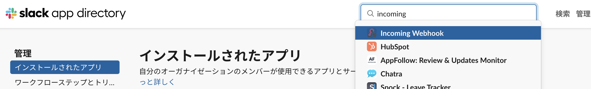

# backlog_slack_notice


上記構成での、BacklogからSlackへの通知のサンプルです

## 前提
以下のサービスのアカウントが必要です。あらかじめご用意ください。
- Slack
- AWS
- Backlog

## 1. SlackのIncoming Webhookの取得
LambdaからSlackへの通知に必要なWebhookURLを取得する


Slackのワークスペースのメニューを開き、「ツールと設定」->「アプリを管理する」を選択


画面上部の検索ボックスに「incoming webhook」と入力し、incoming webhookのページへ遷移


「Slackに追加」を押下


通知先のチャンネルを選択し、「Incoming Webhookインテグレーションの追加」を押下  
遷移先の画面の「Webhook URL」を控えておく

## 2. 関数の作成

関数名：任意  
ランタイム：APIをPythonで実装した為、Pythonを選択


実行ロールは、既存のものがあればそれを使用  
サンプルでは取り敢えず新ロールを作成


「関数URLを有効化」にチェックを入れてエンドポイントを作成  
認証タイプはサンプルなので「NONE」にする  
本運用するならIAM認証を入れたほうがよい


「関数の作成」を押下


関数の作成後、関数URLを控えておく

## 3. プログラムをコピー
src/lambda_function.py を全コピーし、Lambda関数のlambda_function.pyに上書きする  
その後、以下の箇所を直接書き換える。

```
// 変更前
mention_list = {
    "U074D9X38FM": "永井 伸明",
    "U074D9X38F2": "永井 太郎"
}

// 自身のSlackIDとBacklogでのハンドルネームを追加
// SlackIDは以下手順で確認できる
// Slack画面左下の自身のプロフィール画像をクリック->「プロフィール」->メニューアイコン->「メンバーIDをコピー」
mention_list = {
    "U074D9X38FM": "永井 伸明",
    "U074D9X38F2": "永井 太郎",
    "U074D9XHOGE": "名無 一郎"
}
```

```
// 変更前
"title_link": f"https://<自身のBacklogの組織名>.backlog.com/projects/{project_key}",

// 自身のBacklogの組織名に変更する
//Backlogの画面右上から確認可能 
"title_link": f"https://sample.backlog.com/projects/{project_key}",
```

```
// 変更前
webhook_url = '<incoming webhook>'

// 手順1で取得したincoming webhookを貼り付ける
webhook_url = 'https://hooks.slack.com/~~~'
```

書き換えが終わったら、「Test」ボタンの横にある「Deploy」ボタンを押下して反映する

## 4. BacklogでWebhook設定

Backlogの「プロジェクト設定」->「インテグレーション」->「Webhook」->「設定」を押下


「Webhookを追加する」ボタンを押下し、以下を入力。
Webhook名：任意
WebHook URL：手順2で作成した関数のURL
通知するイベント：サンプルなので取り敢えず以下を有効化
・課題の追加
・課題の更新
・課題にコメント

## 5. 実行テスト
課題の作成、更新、コメント追加で指定のチャンネルに通知が来たら成功です。  
通知が来ない場合は、APIでエラーになってるかもしれない為、  
CloudWatch Logsの「/aws/lambda/<関数名>」ロググループでエラー内容を確認してみてください。  
  
また、実行テストは実際に課題を作成、更新する他、  
手順4のwebhook設定ページの下部にある「実行テスト」からも実行可能です
